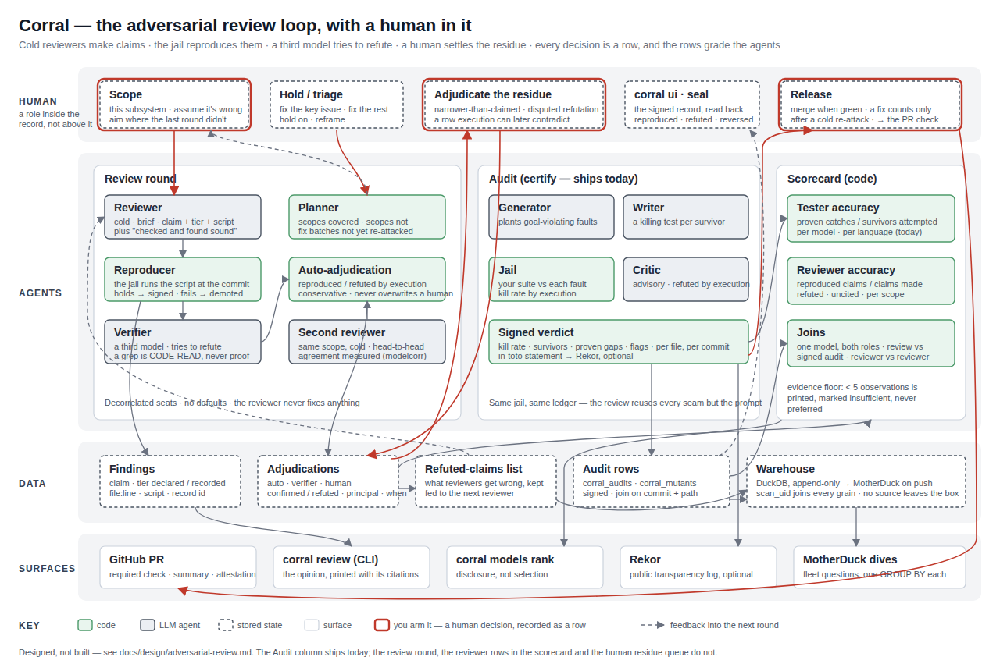

<!-- SPDX-License-Identifier: Elastic-2.0 -->
# Adversarial review — an opinion linked to signed reproductions

**Status: designed, not built.** Written 2026-09-04, the morning after the
fifth cold review of corral itself (PRs #224–#236). Everything in "What
exists" is shipped and cited; everything in "What would be built" is not.
The one-week slice at the end is the proposal.

## Where this came from

Between 2026-09-01 and 2026-09-04 we ran five rounds of review on corral's own
repository. Each round, a model that had never seen the code — no
conversation history, no memory, not the model that had written most of that
week's changes — was handed a commit and one instruction: *assume the code is
wrong, find where, and prove it by execution*. Eleven pull requests came out
of it (#224, #225, #226, #229, #230, #231, #232, #233, #234, #235, #236),
among them a trust anchor that shipped with a default key, a "proven" bug
that could be fabricated, eleven CI gates defeated by one-line edits, and a
model registry that let the repository under audit choose its own auditors.
The field note
[We put five strangers on our own code](../../site/src/content/field-notes/the-reviewer-was-right-and-we-said-no.mdx)
is the narrative; this document is the design the narrative implies.

The reviewers were not writing tests. The trust-anchor finding was a
*derivation*: the public half of the committed seed, compared to the pinned
constant. The registry finding was a *constructed state*: a hostile
`.corral/models.json`, a dry run, the printed resolution. The ranking finding
was four rows in a DuckDB file pushed through the real reader. What they had
in common was not a test — it was **a reproduction anyone can rerun, labeled
by its evidence tier**, and a list of what was checked and found sound. The
reviewers that were wrong were wrong exactly where they skipped the
reproduction and inferred: a roadmap read as shipped, two providers read as
stubs from a grep, and — once — a verifier that dismissed a true finding on a
`grep -rn "func tickAggregate"` that cannot match a method with a receiver
(`AGENTS.md`, "Claims reviewers keep getting wrong").

So the thing worth building is not "AI code review." It is the discipline
that made those five rounds worth eleven pull requests, run by the machinery
corral already has.

## The loop, drawn

(`adversarial-review-loop.svg` is the source.) Four lanes: the human, the
agents, the data, the surfaces. Red outlines are the three places a human
arms the loop — scope, adjudication, release — and each is recorded as a
row, because the human is a role inside the record, not above it. See
"The human's role" below for why that clause matters.

## The shape: opinion → citations → signed reproductions

A review is **prose**. It says things like "the herd is not an allowlist; a
worker's self-report can staff the pool." That is a judgment, and corral does
not sign judgments — a signature on an opinion is the opinion feed with a
seal on it.

What corral signs is the **reproduction**: a script, in the repository's own
language or shell, that the jail ran against the tree at a named commit, with
its output. Each reproduction is recorded under its own record id, the way a
scan's rows are, and the review carries those ids the way an audit statement
carries `warehouseRowsSha256`: a reader goes opinion → citation → record →
reruns it. A review with no citations is visibly a review with no citations.

Three tiers, declared by the reviewer and checked by the run:

| tier | what it is | what corral does with it |
| --- | --- | --- |
| **REPRODUCED** | a claim with a script the jail ran, whose output matches the claim | recorded, signed, citable |
| **CODE-READ** | a claim with `file:line` and no execution | recorded, unsigned, citable as prose only |
| **HYPOTHESIS** | a constructed scenario the reviewer did not execute | recorded, unsigned, listed separately |

Plus a fourth list the reviewer must produce: **checked and found sound** —
what it looked at and could not break. Absence of findings in a subsystem
nobody looked at is not evidence; the sound list is what makes the scope of
the review legible.

This is the same rule the audit statement already follows for numbers. A
kill rate is signed because it was executed; an uncovered file's rate is
withheld, not signed as zero; the honesty flags travel with the number. A
reviewer's claim is signed because its reproduction was executed; a claim
without one is carried as what it is.

## The seats

Four, three of them models, and the decorrelation rule applies to all of
them exactly as it applies to the writer and the critic today.

**The reviewer.** Cold: the repository at a commit, a *scope* ("the router;
assume it is wrong; aim at what the previous round did not touch"), the
brief, and the standing list of claims reviewers keep getting wrong. Its
output is structured findings — claim, tier, `file:line`, and for anything
above HYPOTHESIS a reproduction script — plus the sound list and the opinion
that ties them together. The reviewer never fixes anything.

**The reproducer.** Not a model. The jail runs each script against the tree
and records what it printed. A script that does not reproduce demotes its
finding to CODE-READ on the record, not silently. This is the existing
scorer with a script where the test command goes; the substrate,
concurrency, timeouts and the toolchain binds are already built.

**The verifier.** A *third* model, adversarial to the reviewer: it tries to
refute every REPRODUCED finding and every CODE-READ claim. Its refutations
are tiered by the same rules, and one rule is written down because it was
learned the hard way: **a search that does not find the thing is CODE-READ,
never a refutation.** A refutation that reproduces (the script passes on the
claimed input; the claim was narrower than stated) demotes the finding and
is itself signed.

**The human.** Adjudicates the residue: a reproduction that is genuine but
narrower than the claim drawn from it (the "overstated" case), a refutation
the reviewer disputes, a HYPOTHESIS worth promoting to a scope for the next
round. The human's confirm/refute is final and feeds the scorecard; the
machine's never overrides it. This is the criticscore contract today
(`internal/criticscore`): automatic adjudication is conservative, human
adjudication is authoritative, and a later automatic pass may not overwrite
a human's.

## The human's role

The loop begs for a human, and the obvious design — the human as the final
arbiter, the safety net under the machines — contradicts corral's own
thesis. The thesis is that judgment fails *structurally*: the party that
made the change is the wrong party to grade it, whether that party is a
model or a person, and agentic testing can be exactly as myopic as human
review when it is set up the same way. A human placed above the record, whose
say-so ends every argument and is never itself checked, is that setup again
with a different face. *Nemo iudex* applies to the human too.

So the human gets a role, not an exemption. Five interventions, all of them
observed this week and none of them done by a model:

- **Scope.** Which subsystem, and the standing instruction: assume it is
  wrong, aim where the last round did not. A model can propose the next
  scope (the planner); a person names it.
- **Hold and triage.** "Fix the key issue first." "Hold on." The priority
  call the reviewers cannot make because they do not know what the project
  is for.
- **Reframe.** The trust-anchor finding was a leaked key until a person
  said it was a default-value bug — same fact, truer sentence. Meaning is
  not something execution settles.
- **Adjudicate the residue.** Confirm or refute what the machine could not
  settle: the reproduction that is genuine but narrower than its claim, the
  refutation the reviewer disputes, the hypothesis worth a scope.
- **Release.** The merge is a person's act, and a fix counts only after a
  fresh seat has tried to defeat it.

Two rules keep the role inside the record:

1. **Every intervention is a row with a principal.** An adjudication
   carries who made it and when. A human's dismissal of a finding is not
   erased from the scorecard; it is the scorecard's ground truth *and* a
   claim on the record that a later reproduction can contradict. When it
   is contradicted, the reversal is a row too, and the human sees it in the
   same seal the machines' reversals appear in. This is the difference
   between authority and exemption: the human's word is final for the round
   and reviewable forever.
2. **The residue is budgeted.** Every security scanner ever built had a
   human loop; it was called the findings queue, and it is where findings
   go to die. If a person sees every claim, adjudication decays into
   clicking within a week and the ground truth is anchored to noise.
   Execution settles everything it can; only the residue reaches a person;
   and the size of the residue per round is a metric the loop watches,
   because a rising one means the machine is settling less.

What this does not do is score the human the way it scores a model. A
reversal rate over a person's adjudications is a measure of the *machine's*
calibration against that person, and it is read that way — the same way a
verifier's wrongly-overruled rate is a measure of the verifier. The record
keeps humans honest by keeping their decisions visible, not by ranking them.

In an organization the "who" is the expensive part: an adjudication is an
authority act — it changes a model's score and a file's standing — and it
needs an identity behind it, an audit trail, and a policy about who may
reverse whom. Corral has the identity plumbing (the OIDC gate, the admin
principals) and nothing yet that puts a principal on an adjudication row or
makes a human's reversal itself reviewable. That is a permission model, not
a UI, and it is the part of the loop that would take longest.

## Rounds

Two rules from the week, both mechanical:

- **Aim at what the last round did not touch.** Round one at the gates;
  round four at the scoring engine; round five at the push, the router and
  the learning loop. A planner keeps the scopes covered and uncovered.
- **Re-attack every fix batch cold.** The second pass in round four was told
  the morning's fixes were hours old and to assume they had holes; it
  defeated eleven of them (#233). A fix does not count until a fresh seat
  has tried to defeat it. In corral's own gates this became the
  negative-control rule: every gate test must fail when the gate is
  reverted.

## The scorecard

Nothing about the prose is scored. The **citations** are:

- reviewer model × language × scope → reproduced-finding rate (REPRODUCED
  claims that held through verification and the human), false-claim rate
  (claims refuted or dismissed), and uncited-claim rate (prose with nothing
  under it);
- verifier model → wrongly-overruled rate (refutations a human reversed).

This is `models rank` (`docs/design/model-ranking.md`) with reviewer and
verifier seats added, and it inherits that command's floor: a model with
fewer than five observations in a seat is printed with its real numbers,
marked insufficient, and never preferred. The "claims reviewers keep getting
wrong" list stops being a hand-maintained section of `AGENTS.md` and becomes
the refuted-citation table, fed back to the next reviewer as input.

## One scorecard, two kinds of evidence

The same model can sit in the writer seat on Monday and the reviewer seat
on Tuesday, and corral records both under the same name. That makes three
correlations possible that no single-role tool can make, and all three are
joins over rows that already exist or are defined above.

**A model's profile across roles.** The bugcatch table says how well a
model *tests*: execution-proven catches over survivors attempted, per
language. The findings table would say how well it *reviews*: reproduced
claims over claims made, per language and scope. Joined on the model name,
that is a profile — tests well and reviews badly, or the reverse — and the
first question it answers is whether the two are the same skill. We do not
know. Nobody does, because nobody has both numbers from execution for the
same model on the same code.

**A review against the signed audit of the same code.** A review's
REPRODUCED finding names a `file:line` at a commit. `certify` has signed
that file at that commit: a kill rate, its survivors, the gaps a writer
proved. Joined on (repo, commit, path), the two records agree or they do
not, and both cases are worth a row:

- a finding on a file `certify` signed as weak — the reviewer and the
  mutants point at the same place, two independent measurements agreeing;
- a finding on a file `certify` signed as strong — a suite adequate against
  planted faults but not against the reviewer's scenario. That is not a
  contradiction to resolve, it is the most interesting row in the
  warehouse: mutation adequacy is not correctness, and this is where the
  difference shows up with both halves signed;
- a strong signed audit and a refuted finding — the reviewer was wrong, on
  the record, against evidence that was already there.

The join is coarse today (path, not span — `corral_mutants.span_start` is
defined and nothing produces it yet), and it gets sharper the day mutants
carry their lines.

**Reviewers against each other.** Two cold reviewers on the same scope are a
head-to-head, exactly as two generators are: the challenger machinery
(`internal/modelcorr`, Jaccard and kappa over the two seats' output) applies
to findings without change. Decorrelation between reviewers becomes a
measured number rather than an assumption about vendors — the same
correction the writer/critic pair went through.

The principle underneath all three is the tagline, extended: no agent
judges its own work, *and no agent's judgment of another's work goes
unmeasured*. A tester is graded by execution. A reviewer is graded by
reproduction, against other reviewers, and against the signed result of the
code it reviewed. The human adjudicates the residue, and the adjudication is
a row too.

## The warehouse

A review's citations are rows, and they belong in the same warehouse the
audit rows already go to — the local DuckDB ledger by default, a `md:`
database when the operator pushes (`docs/corral/actions-as-swarm.md`). Three
grains, additive to the five `certify` pushes today, joined on the same
`scan_uid`:

| grain | one row per | carries |
| --- | --- | --- |
| `corral_reviews` | review | commit, scope, reviewer model, verifier model, statement hash |
| `corral_findings` | claim | tier as declared, tier as recorded, `file:line`, severity, the reproduction's record id |
| `corral_adjudications` | decision | who (auto / verifier model / human), confirmed or refuted, when |

Nothing prose is stored except the claim text itself; the opinion travels as
a document with ids in it, the way the statement does. Source never leaves
the box: a reproduction script is stored, its stdout is stored, the tree it
ran against is not — the same custody rule as `--push-source`.

The questions this answers are the ones nobody can answer about a review
tool today, and they are one `GROUP BY` each on a warehouse with more than
one repository in it:

- Which reviewer model's claims reproduce, per language and per scope — the
  reviewer seat's row in `models rank`, across every repository an
  organization audits rather than one.
- Which claims were refuted, by whom, and how often a human reversed the
  machine: the verifier's wrongly-overruled rate, the automatic pass's
  false-refutation rate.
- The time from a REPRODUCED finding to the commit that fixed it, joined to
  the scan that proved the fix (the re-attack round's rows point at it).
- The cross-role profile and the review-vs-audit join above, which need a
  warehouse with both kinds of rows in it — one repository's ledger has too
  few of either to clear the evidence floor.
- Recurrence: the same claim on the same target across rounds or across
  repositories — `internal/learn` already detects this over the findings
  table locally; the warehouse makes it a fleet question.

The cost discipline is unchanged: local DuckDB first, `md:` only for pushes,
shares and the dive query itself, no automated jobs against it. A review
that ran on a runner pushes once, at the end, under the same `--push` flag
`certify` uses.

## What exists

Every mechanism below is shipped and in use by `certify`:

- role-keyed seats with decorrelation enforced before spend
  (`internal/advpool/roles.go`, `CheckDecorrelation`), and the registry
  that names them (`internal/models`);
- a queue that fans seats out to models and collects structured results
  (`internal/queue`), with a findings table already carrying type,
  severity, target, evidence, status and a reporter model
  (`internal/queue/findings.go`);
- a jail that runs an arbitrary command against a tree on two substrates
  with per-language toolchain binds (`internal/adequacy`, `internal/sandbox`);
- execution-based adjudication of a model's claims, with human override
  and a rule that automatic passes never overwrite a human's
  (`internal/advpool/critic_adjudicate.go`, `internal/criticscore`);
- signed records and in-toto statements whose predicates cite what was
  executed (`internal/certify`), and a warehouse whose rows cite the
  statement back (`internal/auditpush`);
- a model scorecard fed only by execution-proven outcomes, with an evidence
  floor (`internal/bugcatch`, `internal/modelrank`);
- a recurrence detector over findings (`internal/learn`).

## What would be built

- **The reviewer brief and output schema.** A prompt, and a JSON shape for
  findings with tiers, scripts and the sound list. The prompt is the one we
  used by hand; the schema is the findings table plus three fields (tier,
  script, citations).
- **Reproduction scripts in the jail.** The scorer accepts a test command;
  it would accept a script and record stdout/exit rather than kill/survive.
  Small: the jail already binds the toolchain for whatever the command names.
- **The verifier seat and its rules.** A second brief, and the tier check on
  refutations.
- **`corral review`.** `--scope <dir|subsystem>`, the seats named like every
  other seat (no defaults), `--record` into the same ledger, a printed
  opinion with its citations, a `--attest` statement whose predicate is the
  list of reproductions.
- **Reviewer and verifier rows in `models rank`.**
- **The three warehouse grains**, additive, in `internal/auditpush`, with
  the seal and the dives extended to read them.
- **A round planner** — scopes covered, scopes not, fix batches not yet
  re-attacked. Last, because a human did this well by hand all week.
- **Principals on adjudication rows**, and a reversal that is itself a row
  the seal shows — the permission model from "The human's role."

## What this is not

It is not a signed design review. The signature covers the reproductions; the
design judgment drawn from them is prose, and the product must say so on
every surface or it becomes the thing it is arguing against.

It is not per-PR review. Each of the week's reviews was roughly 220 000
tokens and 90 tool calls of a frontier model; five rounds, up to three
reviewers each. That is a launch-week audit or a release gate, not a
required check on every push. Per-PR is `certify`, which already exists.

It is not a replacement for the human. The scoping ("the push, the router,
the loop next") and the residue adjudication were done by people all week,
and the one time the machine overruled a reviewer on its own, it was wrong.

## On rigor, and the field

As of 2026-09-04 we know of several AI review tools that post findings on
pull requests. We have not found one that requires a reviewer to reproduce
what it claims before the claim is recorded, that keeps the reviewer's
refuted claims and scores the reviewer by them, or that links a review's
prose to signed, rerunnable reproductions. We may have missed one; this is
what we looked for and did not find, not a claim about any product's
internals. If it exists, the comparison worth making is on those three
properties, because they are the whole difference between a review and an
opinion.

## The one-week slice

`corral review --scope internal/brain --reviewer-model <m> --record`:
the brief, the tiers, jail-run reproductions, the findings recorded in the
existing ledger, the opinion printed with its citations, no verifier seat,
the human adjudicating in the existing criticscore store. It reuses every
seam `certify` has except the prompt and the script runner. The verifier,
the statement, the scorecard rows and the planner follow, in that order,
each only after the previous one has been run on corral itself and found
wanting by a stranger.
