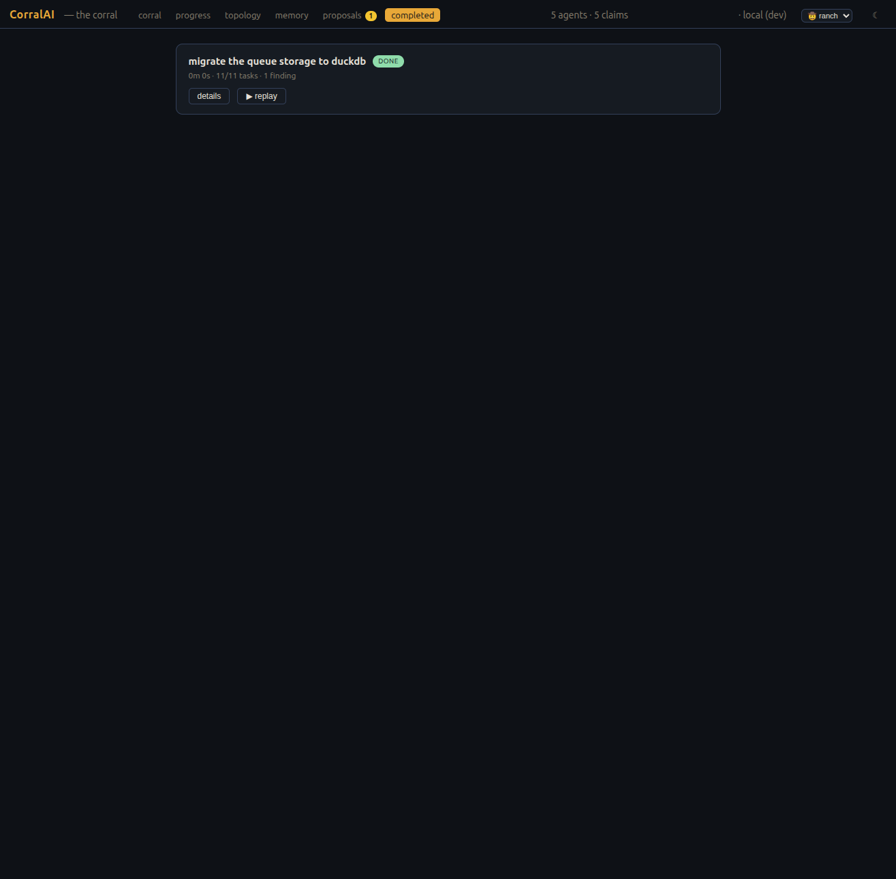

The Completed tab lists every finished mission. Opening one's replay plays
back its whole build — task claims, findings, and executions — through the
same control bar this site's own landing-page hero embeds. See [mission
history + replay](/docs/concepts/history-and-replay/) for how the stream is
reconstructed from durable rows, not a live recording.

