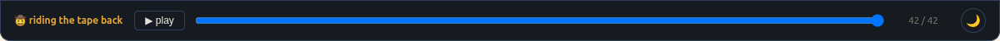

The Completed tab lists every finished `corral certify --local` run. Opening
one's replay plays back the whole audit — shard claims, survivor findings,
and jail executions — through the same control bar this site's own
landing-page hero embeds. See [mission history + replay](/docs/concepts/history-and-replay/)
for how the stream is reconstructed from durable rows, not a live recording.

![The Completed tab, expanded into the "what you just watched" hero breakdown for "certify more-itertools: full_permutation": a verdict strip reading "CERTIFIED · killed 18/20 · 2 survivors"; below it an expandable panel showing what was tested (the goal and the audited file), the decorrelated herd that ran it (gemini-3.5-flash/mutant-generator, claude-sonnet-5/test-writer, claude-haiku-4-5/test-critic, each with its host and jail), what happened in the jail (20 mutants planted, 18 killed, 2 survivors — 1 proven by the test-writer, 1 still unproven), and an honest-limits section quoting the test-critic's full argument: "test_full_permutation asserts range(3) == (0, 1, 2), which is always False in Python 3 — the assertion never fires, so this test proves nothing"; "details" and "replay" buttons below](../../../../assets/ui-tour/completed.png)

Every replay opens on that same hero verdict strip — CERTIFIED or
NEEDS-REVIEW, the kill-rate, and the survivor count at a glance — before you
even press play, and it stays expandable throughout: what was actually
tested, the decorrelated herd that ran it, what happened inside the jail,
and the honest-limits section with the test-critic's **actual argument**,
not a summary of it, so you can judge the advisory second opinion yourself
instead of taking the badge's word for it.

## Task-story modal

Clicking into an individual shard opens its task-story modal — what that
seat did, in order. For a test-critic seat this now surfaces the critic's
**full argument** (its finding evidence: the line it flagged, the reasoning,
and what it would have said in review), not just the one-line target it
flagged, so the advisory opinion is auditable rather than a black box.

